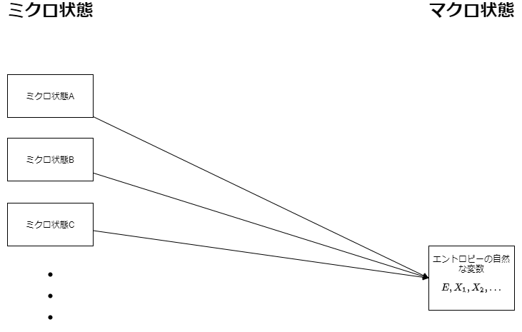

\newpage

# 孤立した単純な古典系の統計力学

## 等重率の原理
古典系の統計力学では、以下の2つを念頭に置く。

**ミクロな状態**
: その系の(途方も無い)自由度のぶんだけの一般化運動量と一般化座標の次元をもつ**相空間**があれば、その上の1点は必ず系のひとつのミクロ状態を記述している。

**マクロな状態**
: エントロピーとその自然な変数で張られる(ミクロ系よりは)ごく少ない自由度の**相空間**上の一点を使ってその系の平衡状態を指定できる

{#fig:micro_macro}

[@fig:micro_macro]のマクロ状態で指定した状態が平衡状態の場合、左側の｢ミクロ状態｣から任意のものを一つ選び出してきたとき、取り出された状態の**ほぼ全て**が区別できず、同じ平衡状態に対応するとしよう。これは統計力学の要請のもっとも基本的なものの一つである。

<!--逆説的にいえば、マクロな視点で見ているからこそ、ミクロな状態一つ一つを区別して扱うということができず、それらをまとめて平衡状態として扱い、そのために統計的な見方が必要になったとも言えるのかも-->

この操作で選び出す母集団となったミクロ状態たちを**ミクロカノニカル集団**とよぶ。

ここでいう**ほぼ全て**は、以下の極限で確率100%になるとする。

熱力学極限
: エントロピーの自然な変数の**密度**を一定にしながら、体積をあらゆる方向に一樣に大きくしていって無限大にする極限のこと

<!--これが成立していると仮定すると、平衡状態に含まれるようなミクロ状態は体積に対して非線形に増えていくことになる。-->

ミクロカノニカル集団の要素それぞれの実現確率を等しく与えた確率分布のことを**ミクロカノニカル分布**とよぶ。先ほどの要請と合わせると、ミクロカノニカル分布は平衡状態とマクロにみて同じ状態を実現する。

これを等重率の原理として採用する。
これによれば、

- マクロな変化がない限り、平衡状態は平衡状態のままである
- 殆どの場合、孤立した単純系は平衡状態にやがて落ち着く

というマクロな観測は以下のように説明される。

｢ミクロな状態は平衡状態でも時間発展している。その時間発展とはミクロカノニカル集団のうちのある要素から別の要素に移ることにほかならないが、非平衡状態からそれを繰り返せば圧倒的大多数であるところの平衡状態にたどり着く。十分マクロな系では、一度平衡状態になったときに次の状態が非平衡状態になる確率はゼロである。｣

非常に普遍的な事実をこのように自然な形で説明できるというのがこの原理を採用する理論のよいところである。
等重率の｢原理｣は自然界が厳密に従う原理というわけではなく、理論で公理的に採用して自然現象を理解しようという意味での原理である。そして、仮説であるところのこの公理からマクロな物理量を計算したときに、確率的なゆらぎが小さければ検証が可能である。

<!--ゆらぎの話と有効数字の話は根本的に相性良すぎてどうなんって話もある気がする-->

## エントロピーをミクロな視点から計算できるか?

熱力学は、ミクロな物理量から直接には定めることができない、**純熱力学変数**が含まれている。
等重率の原理は、ミクロな物理量がマクロな物理量として現れてくるときに平均が使えることを教えてくれるから、力学変数についてはマクロなスケールでも知ることができる。
ここでは純熱力学変数をマクロな物理学に整合するように、等重率の原理とミクロな物理学を用いてエントロピーを求める方法がないか推測する。
もし正しく求められるものがあれば、それを要請として統計力学を構築すれば良い。

等重率の原理が教えてくれるのはミクロなエネルギーの分布であるから、エネルギーとエントロピーとの関係を考えてみよう。
熱力学から得られる知見として、

> 熱の交換が可能な2つの単純系からなる複合系が平衡状態に達しているとき、
> それらの単純系のエントロピーのエネルギーに共役な示強変数(**逆温度**)の値は一致する

というものがある。平衡状態についての記述は別にエネルギーに共役な物に限らずあらゆる示強変数について言えるだろうが、以下では等重率の原理が直接に決めるエネルギーに関する平衡条件だけを考えるので、逆温度についてのこの関係を使っていこう。

ここでミクロカノニカル分布をしているのは単純系に限っていたことに気づく。
では逆に考えて、単純系を全く無意味な壁で区切って部分系(1)と部分系(2)からなる複合系とみなせば良いのである。
そうすれば、単純系の中で逆温度の等式が利用できる。

部分系がそれぞれ十分に大きく、先程の｢無意味な壁｣のあたりで起きる系間の相互作用が無視できるほどであれば、それぞれの部分系が孤立しているときの状態数の積で全系の状態数が表せるはずだ。
この仮定は、粒子間の相互作用には短距離力しか効かないという
ミクロカノニカル分布によれば、
